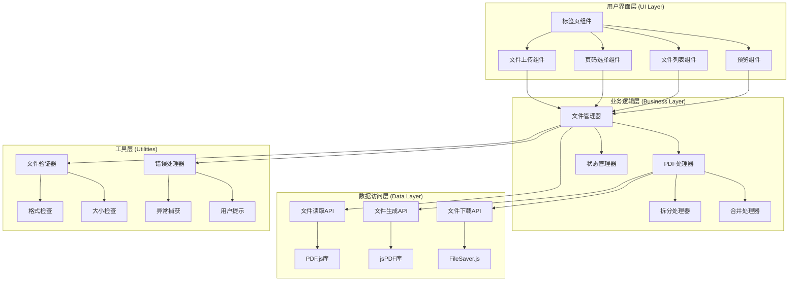

# PDF工具箱 - 详细设计文档 (Design Document)

**版本**: v1.0  
**创建时间**: 2025-11-18  
**技术负责人**: AI Assistant  
**基于**: PRD v1.0

---

## 1. 设计概览

### 1.1 设计目标
基于PRD需求，设计一个高性能、用户友好的纯前端PDF处理工具，实现PDF拆分与合并功能，确保代码可维护性和扩展性。

### 1.2 设计原则
- **模块化设计**: 功能模块独立，便于维护和测试
- **响应式优先**: 移动端和桌面端统一体验
- **性能优化**: 大文件处理的内存和速度优化
- **用户体验**: 直观的交互和及时的反馈
- **安全性**: 客户端处理，数据不离开设备

---

## 2. 系统架构设计

### 2.1 整体架构图



### 2.2 技术栈选择

#### 2.2.1 核心库依赖
```json
{
  "dependencies": {
    "pdf-lib": "^1.17.1",
    "pdfjs-dist": "^3.11.174",
    "file-saver": "^2.0.5"
  },
  "devDependencies": {
    "webpack": "^5.89.0",
    "babel-core": "^6.26.3",
    "css-loader": "^6.8.1",
    "html-webpack-plugin": "^5.5.3"
  }
}
```

#### 2.2.2 构建工具配置
```javascript
// webpack.config.js
module.exports = {
  entry: './src/index.js',
  output: {
    path: path.resolve(__dirname, 'dist'),
    filename: 'bundle.[contenthash].js'
  },
  module: {
    rules: [
      {
        test: /\.js$/,
        use: 'babel-loader',
        exclude: /node_modules/
      },
      {
        test: /\.css$/,
        use: ['style-loader', 'css-loader']
      }
    ]
  },
  plugins: [
    new HtmlWebpackPlugin({
      template: './src/index.html'
    })
  ]
};
```

---

## 3. 详细模块设计

### 3.1 文件管理模块 (FileManager)

#### 3.1.1 类结构设计
```javascript
class FileManager {
  constructor() {
    this.splitFile = null;
    this.mergeFiles = [];
    this.maxFileSize = 50 * 1024 * 1024; // 50MB
    this.allowedTypes = ['application/pdf'];
  }

  // 文件验证
  validateFile(file) {
    const errors = [];
    
    if (!this.allowedTypes.includes(file.type)) {
      errors.push('仅支持PDF格式文件');
    }
    
    if (file.size > this.maxFileSize) {
      errors.push(`文件大小不能超过${this.formatFileSize(this.maxFileSize)}`);
    }
    
    if (file.size === 0) {
      errors.push('文件不能为空');
    }
    
    return {
      isValid: errors.length === 0,
      errors: errors
    };
  }

  // 添加拆分文件
  setSplitFile(file) {
    const validation = this.validateFile(file);
    if (!validation.isValid) {
      throw new Error(validation.errors.join(', '));
    }
    
    this.splitFile = {
      id: this.generateId(),
      file: file,
      name: file.name,
      size: file.size,
      uploadTime: new Date(),
      pageCount: null // 将通过PDF解析获取
    };
    
    return this.splitFile;
  }

  // 添加合并文件
  addMergeFile(file) {
    const validation = this.validateFile(file);
    if (!validation.isValid) {
      throw new Error(validation.errors.join(', '));
    }
    
    const fileInfo = {
      id: this.generateId(),
      file: file,
      name: file.name,
      size: file.size,
      uploadTime: new Date(),
      pageCount: null,
      order: this.mergeFiles.length
    };
    
    this.mergeFiles.push(fileInfo);
    return fileInfo;
  }

  // 移除合并文件
  removeMergeFile(fileId) {
    const index = this.mergeFiles.findIndex(f => f.id === fileId);
    if (index !== -1) {
      this.mergeFiles.splice(index, 1);
      this.updateMergeOrder();
    }
  }

  // 更新合并文件顺序
  reorderMergeFiles(fromIndex, toIndex) {
    const [movedFile] = this.mergeFiles.splice(fromIndex, 1);
    this.mergeFiles.splice(toIndex, 0, movedFile);
    this.updateMergeOrder();
  }

  // 工具方法
  generateId() {
    return Date.now().toString(36) + Math.random().toString(36).substr(2);
  }

  formatFileSize(bytes) {
    if (bytes === 0) return '0 B';
    const k = 1024;
    const sizes = ['B', 'KB', 'MB', 'GB'];
    const i = Math.floor(Math.log(bytes) / Math.log(k));
    return parseFloat((bytes / Math.pow(k, i)).toFixed(2)) + ' ' + sizes[i];
  }

  updateMergeOrder() {
    this.mergeFiles.forEach((file, index) => {
      file.order = index;
    });
  }
}
```

#### 3.1.2 状态管理设计
```javascript
class StateManager {
  constructor() {
    this.state = {
      currentTab: 'split',
      splitFile: null,
      mergeFiles: [],
      processing: false,
      processingType: null,
      processingProgress: 0,
      lastResult: null,
      errors: []
    };
    
    this.listeners = new Map();
  }

  // 状态更新
  setState(newState) {
    const prevState = { ...this.state };
    this.state = { ...this.state, ...newState };
    this.notifyListeners(prevState, this.state);
  }

  // 监听器管理
  subscribe(key, callback) {
    if (!this.listeners.has(key)) {
      this.listeners.set(key, []);
    }
    this.listeners.get(key).push(callback);
    
    return () => {
      const callbacks = this.listeners.get(key);
      const index = callbacks.indexOf(callback);
      if (index !== -1) {
        callbacks.splice(index, 1);
      }
    };
  }

  notifyListeners(prevState, newState) {
    this.listeners.forEach((callbacks, key) => {
      if (prevState[key] !== newState[key]) {
        callbacks.forEach(callback => callback(newState[key], prevState[key]));
      }
    });
  }

  // 业务状态方法
  setProcessing(type, progress = 0) {
    this.setState({
      processing: true,
      processingType: type,
      processingProgress: progress
    });
  }

  setProcessingComplete(result) {
    this.setState({
      processing: false,
      processingType: null,
      processingProgress: 100,
      lastResult: result
    });
  }

  addError(error) {
    this.setState({
      errors: [...this.state.errors, {
        id: Date.now(),
        message: error.message || error,
        timestamp: new Date(),
        type: 'error'
      }]
    });
  }

  clearErrors() {
    this.setState({ errors: [] });
  }
}
```

### 3.2 PDF处理模块 (PDFProcessor)

#### 3.2.1 PDF解析器设计
```javascript
class PDFParser {
  constructor() {
    this.pdfjsLib = null;
    this.initialized = false;
  }

  async initialize() {
    if (this.initialized) return;
    
    // 动态加载PDF.js
    this.pdfjsLib = await import(/* webpackChunkName: "pdfjs" */ 'pdfjs-dist');
    this.pdfjsLib.GlobalWorkerOptions.workerSrc = 
      'https://cdnjs.cloudflare.com/ajax/libs/pdf.js/3.11.174/pdf.worker.min.js';
    
    this.initialized = true;
  }

  async parseFile(file) {
    await this.initialize();
    
    return new Promise((resolve, reject) => {
      const fileReader = new FileReader();
      
      fileReader.onload = async (e) => {
        try {
          const arrayBuffer = e.target.result;
          const pdf = await this.pdfjsLib.getDocument({ data: arrayBuffer }).promise;
          
          const info = {
            pageCount: pdf.numPages,
            title: await this.getMetadata(pdf, 'Title'),
            author: await this.getMetadata(pdf, 'Author'),
            creator: await this.getMetadata(pdf, 'Creator'),
            producer: await this.getMetadata(pdf, 'Producer'),
            creationDate: await this.getMetadata(pdf, 'CreationDate'),
            modificationDate: await this.getMetadata(pdf, 'ModDate')
          };
          
          resolve({ pdf, info });
        } catch (error) {
          reject(new Error(`PDF解析失败: ${error.message}`));
        }
      };
      
      fileReader.onerror = () => {
        reject(new Error('文件读取失败'));
      };
      
      fileReader.readAsArrayBuffer(file);
    });
  }

  async getMetadata(pdf, key) {
    try {
      const metadata = await pdf.getMetadata();
      return metadata.info[key] || null;
    } catch {
      return null;
    }
  }

  async renderPageThumbnail(pdf, pageNum, scale = 0.3) {
    try {
      const page = await pdf.getPage(pageNum);
      const viewport = page.getViewport({ scale });
      
      const canvas = document.createElement('canvas');
      const context = canvas.getContext('2d');
      canvas.height = viewport.height;
      canvas.width = viewport.width;
      
      await page.render({
        canvasContext: context,
        viewport: viewport
      }).promise;
      
      return canvas.toDataURL();
    } catch (error) {
      console.warn(`渲染第${pageNum}页缩略图失败:`, error);
      return null;
    }
  }
}
```

#### 3.2.2 PDF拆分处理器
```javascript
class PDFSplitter {
  constructor() {
    this.pdfLib = null;
  }

  async initialize() {
    if (!this.pdfLib) {
      this.pdfLib = await import(/* webpackChunkName: "pdf-lib" */ 'pdf-lib');
    }
  }

  async split(file, startPage, endPage, onProgress) {
    await this.initialize();
    
    try {
      onProgress?.(10, '读取PDF文件...');
      
      // 读取源文件
      const arrayBuffer = await this.readFileAsArrayBuffer(file);
      const sourcePdf = await this.pdfLib.PDFDocument.load(arrayBuffer);
      
      onProgress?.(30, '创建新文档...');
      
      // 创建新文档
      const newPdf = await this.pdfLib.PDFDocument.create();
      
      // 验证页码范围
      const totalPages = sourcePdf.getPageCount();
      if (startPage < 1 || endPage > totalPages || startPage > endPage) {
        throw new Error(`无效的页码范围: ${startPage}-${endPage} (总页数: ${totalPages})`);
      }
      
      onProgress?.(50, '复制指定页面...');
      
      // 复制指定页面
      const pageIndices = [];
      for (let i = startPage - 1; i < endPage; i++) {
        pageIndices.push(i);
      }
      
      const copiedPages = await newPdf.copyPages(sourcePdf, pageIndices);
      
      onProgress?.(80, '生成新文档...');
      
      // 添加页面到新文档
      copiedPages.forEach(page => {
        newPdf.addPage(page);
      });
      
      // 设置文档元数据
      newPdf.setTitle(`${file.name.replace('.pdf', '')}_第${startPage}-${endPage}页`);
      newPdf.setCreator('PDF工具箱');
      newPdf.setCreationDate(new Date());
      
      onProgress?.(95, '保存文档...');
      
      // 生成PDF字节数组
      const pdfBytes = await newPdf.save();
      
      onProgress?.(100, '完成!');
      
      return {
        fileName: `${file.name.replace('.pdf', '')}_第${startPage}-${endPage}页.pdf`,
        data: pdfBytes,
        pageCount: endPage - startPage + 1,
        originalPages: `${startPage}-${endPage}`,
        size: pdfBytes.length
      };
      
    } catch (error) {
      throw new Error(`PDF拆分失败: ${error.message}`);
    }
  }

  readFileAsArrayBuffer(file) {
    return new Promise((resolve, reject) => {
      const reader = new FileReader();
      reader.onload = e => resolve(e.target.result);
      reader.onerror = () => reject(new Error('文件读取失败'));
      reader.readAsArrayBuffer(file);
    });
  }
}
```

#### 3.2.3 PDF合并处理器
```javascript
class PDFMerger {
  constructor() {
    this.pdfLib = null;
  }

  async initialize() {
    if (!this.pdfLib) {
      this.pdfLib = await import(/* webpackChunkName: "pdf-lib" */ 'pdf-lib');
    }
  }

  async merge(files, onProgress) {
    await this.initialize();
    
    if (files.length < 2) {
      throw new Error('至少需要2个PDF文件才能合并');
    }
    
    try {
      onProgress?.(5, '初始化合并文档...');
      
      const mergedPdf = await this.pdfLib.PDFDocument.create();
      let totalPages = 0;
      
      for (let i = 0; i < files.length; i++) {
        const file = files[i];
        const progress = 10 + (i / files.length) * 80;
        
        onProgress?.(progress, `处理文件 ${i + 1}/${files.length}: ${file.name}`);
        
        // 读取PDF文件
        const arrayBuffer = await this.readFileAsArrayBuffer(file.file);
        const pdf = await this.pdfLib.PDFDocument.load(arrayBuffer);
        
        // 获取所有页面
        const pageCount = pdf.getPageCount();
        const pageIndices = Array.from({ length: pageCount }, (_, i) => i);
        
        // 复制页面
        const copiedPages = await mergedPdf.copyPages(pdf, pageIndices);
        
        // 添加页面到合并文档
        copiedPages.forEach(page => {
          mergedPdf.addPage(page);
        });
        
        totalPages += pageCount;
      }
      
      onProgress?.(95, '保存合并文档...');
      
      // 设置文档元数据
      const timestamp = new Date();
      const fileName = `合并文档_${timestamp.getFullYear()}${String(timestamp.getMonth() + 1).padStart(2, '0')}${String(timestamp.getDate()).padStart(2, '0')}_${String(timestamp.getHours()).padStart(2, '0')}${String(timestamp.getMinutes()).padStart(2, '0')}${String(timestamp.getSeconds()).padStart(2, '0')}.pdf`;
      
      mergedPdf.setTitle(fileName.replace('.pdf', ''));
      mergedPdf.setCreator('PDF工具箱');
      mergedPdf.setCreationDate(timestamp);
      
      // 生成PDF字节数组
      const pdfBytes = await mergedPdf.save();
      
      onProgress?.(100, '合并完成!');
      
      return {
        fileName,
        data: pdfBytes,
        pageCount: totalPages,
        fileCount: files.length,
        size: pdfBytes.length,
        sourceFiles: files.map(f => f.name)
      };
      
    } catch (error) {
      throw new Error(`PDF合并失败: ${error.message}`);
    }
  }

  readFileAsArrayBuffer(file) {
    return new Promise((resolve, reject) => {
      const reader = new FileReader();
      reader.onload = e => resolve(e.target.result);
      reader.onerror = () => reject(new Error('文件读取失败'));
      reader.readAsArrayBuffer(file);
    });
  }
}
```

### 3.3 UI组件设计

#### 3.3.1 文件上传组件
```javascript
class FileUploadComponent {
  constructor(container, options = {}) {
    this.container = container;
    this.options = {
      multiple: false,
      accept: '.pdf',
      maxSize: 50 * 1024 * 1024,
      onFileSelect: null,
      onError: null,
      ...options
    };
    
    this.dragCounter = 0;
    this.init();
  }

  init() {
    this.render();
    this.bindEvents();
  }

  render() {
    this.container.innerHTML = `
      <div class="upload-area" id="upload-area">
        <div class="upload-icon">📁</div>
        <div class="upload-text">
          ${this.options.multiple ? '点击选择或拖拽多个PDF文件到此处' : '点击选择或拖拽PDF文件到此处'}
        </div>
        <div class="upload-hint">
          支持PDF格式，${this.options.multiple ? '可选择多个文件，' : ''}最大${this.formatFileSize(this.options.maxSize)}
        </div>
        <input type="file" 
               id="file-input" 
               class="file-input" 
               accept="${this.options.accept}"
               ${this.options.multiple ? 'multiple' : ''}>
      </div>
    `;
  }

  bindEvents() {
    const uploadArea = this.container.querySelector('#upload-area');
    const fileInput = this.container.querySelector('#file-input');

    // 点击上传
    uploadArea.addEventListener('click', () => {
      fileInput.click();
    });

    // 文件选择
    fileInput.addEventListener('change', (e) => {
      this.handleFiles(Array.from(e.target.files));
    });

    // 拖拽事件
    uploadArea.addEventListener('dragenter', (e) => {
      e.preventDefault();
      this.dragCounter++;
      uploadArea.classList.add('dragover');
    });

    uploadArea.addEventListener('dragleave', (e) => {
      e.preventDefault();
      this.dragCounter--;
      if (this.dragCounter === 0) {
        uploadArea.classList.remove('dragover');
      }
    });

    uploadArea.addEventListener('dragover', (e) => {
      e.preventDefault();
    });

    uploadArea.addEventListener('drop', (e) => {
      e.preventDefault();
      this.dragCounter = 0;
      uploadArea.classList.remove('dragover');
      
      const files = Array.from(e.dataTransfer.files);
      this.handleFiles(files);
    });
  }

  handleFiles(files) {
    const validFiles = [];
    const errors = [];

    files.forEach(file => {
      const validation = this.validateFile(file);
      if (validation.isValid) {
        validFiles.push(file);
      } else {
        errors.push(`${file.name}: ${validation.errors.join(', ')}`);
      }
    });

    if (validFiles.length > 0) {
      this.options.onFileSelect?.(this.options.multiple ? validFiles : validFiles[0]);
    }

    if (errors.length > 0) {
      this.options.onError?.(errors);
    }
  }

  validateFile(file) {
    const errors = [];
    
    if (file.type !== 'application/pdf') {
      errors.push('仅支持PDF格式');
    }
    
    if (file.size > this.options.maxSize) {
      errors.push(`文件大小超过${this.formatFileSize(this.options.maxSize)}`);
    }
    
    if (file.size === 0) {
      errors.push('文件为空');
    }
    
    return {
      isValid: errors.length === 0,
      errors
    };
  }

  formatFileSize(bytes) {
    if (bytes === 0) return '0 B';
    const k = 1024;
    const sizes = ['B', 'KB', 'MB', 'GB'];
    const i = Math.floor(Math.log(bytes) / Math.log(k));
    return parseFloat((bytes / Math.pow(k, i)).toFixed(2)) + ' ' + sizes[i];
  }

  reset() {
    this.container.querySelector('#file-input').value = '';
    this.dragCounter = 0;
    this.container.querySelector('#upload-area').classList.remove('dragover');
  }
}
```

#### 3.3.2 页码选择组件
```javascript
class PageRangeSelector {
  constructor(container, options = {}) {
    this.container = container;
    this.options = {
      totalPages: 1,
      defaultStart: 1,
      defaultEnd: 1,
      onChange: null,
      ...options
    };
    
    this.currentStart = this.options.defaultStart;
    this.currentEnd = this.options.defaultEnd;
    this.init();
  }

  init() {
    this.render();
    this.bindEvents();
  }

  render() {
    this.container.innerHTML = `
      <div class="page-range">
        <label class="page-range-label">选择页码范围：</label>
        <div class="page-range-inputs">
          <span>从第</span>
          <input type="number" 
                 id="start-page" 
                 class="page-input" 
                 min="1" 
                 max="${this.options.totalPages}"
                 value="${this.currentStart}">
          <span>页到第</span>
          <input type="number" 
                 id="end-page" 
                 class="page-input" 
                 min="1" 
                 max="${this.options.totalPages}"
                 value="${this.currentEnd}">
          <span>页</span>
        </div>
        <div class="page-range-info">
          将提取 <span id="page-count">${this.currentEnd - this.currentStart + 1}</span> 页内容
        </div>
        <div class="page-range-preview" id="page-preview" style="display: none;">
          <div class="preview-title">页面预览</div>
          <div class="preview-thumbnails" id="preview-thumbnails"></div>
        </div>
      </div>
    `;
  }

  bindEvents() {
    const startInput = this.container.querySelector('#start-page');
    const endInput = this.container.querySelector('#end-page');

    startInput.addEventListener('input', () => {
      this.validateAndUpdate();
    });

    endInput.addEventListener('input', () => {
      this.validateAndUpdate();
    });

    startInput.addEventListener('blur', () => {
      this.validateAndUpdate();
    });

    endInput.addEventListener('blur', () => {
      this.validateAndUpdate();
    });
  }

  validateAndUpdate() {
    const startInput = this.container.querySelector('#start-page');
    const endInput = this.container.querySelector('#end-page');
    const pageCountSpan = this.container.querySelector('#page-count');

    let startPage = parseInt(startInput.value) || 1;
    let endPage = parseInt(endInput.value) || 1;

    // 验证和修正范围
    startPage = Math.max(1, Math.min(startPage, this.options.totalPages));
    endPage = Math.max(startPage, Math.min(endPage, this.options.totalPages));

    // 更新输入框
    startInput.value = startPage;
    endInput.value = endPage;

    // 更新页数显示
    const pageCount = endPage - startPage + 1;
    pageCountSpan.textContent = pageCount;

    // 更新内部状态
    this.currentStart = startPage;
    this.currentEnd = endPage;

    // 触发回调
    this.options.onChange?.({
      startPage,
      endPage,
      pageCount
    });
  }

  updateTotalPages(totalPages) {
    this.options.totalPages = totalPages;
    
    const startInput = this.container.querySelector('#start-page');
    const endInput = this.container.querySelector('#end-page');
    
    startInput.max = totalPages;
    endInput.max = totalPages;
    endInput.value = totalPages;
    
    this.validateAndUpdate();
  }

  async showPagePreview(pdf, startPage, endPage) {
    const previewContainer = this.container.querySelector('#page-preview');
    const thumbnailsContainer = this.container.querySelector('#preview-thumbnails');
    
    previewContainer.style.display = 'block';
    thumbnailsContainer.innerHTML = '<div class="loading-thumbnails">生成预览中...</div>';
    
    try {
      const thumbnails = [];
      for (let pageNum = startPage; pageNum <= Math.min(endPage, startPage + 4); pageNum++) {
        const thumbnail = await this.generateThumbnail(pdf, pageNum);
        if (thumbnail) {
          thumbnails.push({
            pageNum,
            dataUrl: thumbnail
          });
        }
      }
      
      thumbnailsContainer.innerHTML = thumbnails.map(thumb => `
        <div class="thumbnail-item">
          
          <div class="thumbnail-label">第${thumb.pageNum}页</div>
        </div>
      `).join('');
      
      if (endPage > startPage + 4) {
        thumbnailsContainer.innerHTML += `
          <div class="thumbnail-more">
            ... 还有 ${endPage - startPage - 4} 页
          </div>
        `;
      }
      
    } catch (error) {
      thumbnailsContainer.innerHTML = '<div class="preview-error">预览生成失败</div>';
    }
  }

  async generateThumbnail(pdf, pageNum) {
    try {
      const page = await pdf.getPage(pageNum);
      const scale = 0.5;
      const viewport = page.getViewport({ scale });
      
      const canvas = document.createElement('canvas');
      const context = canvas.getContext('2d');
      canvas.height = viewport.height;
      canvas.width = viewport.width;
      
      await page.render({
        canvasContext: context,
        viewport: viewport
      }).promise;
      
      return canvas.toDataURL('image/jpeg', 0.8);
    } catch (error) {
      console.warn(`生成第${pageNum}页缩略图失败:`, error);
      return null;
    }
  }

  getRange() {
    return {
      startPage: this.currentStart,
      endPage: this.currentEnd,
      pageCount: this.currentEnd - this.currentStart + 1
    };
  }

  reset() {
    this.currentStart = this.options.defaultStart;
    this.currentEnd = this.options.defaultEnd;
    this.render();
    this.bindEvents();
  }
}
```

#### 3.3.3 文件列表组件
```javascript
class FileListComponent {
  constructor(container, options = {}) {
    this.container = container;
    this.options = {
      sortable: false,
      showThumbnails: false,
      onRemove: null,
      onReorder: null,
      onPreview: null,
      ...options
    };
    
    this.files = [];
    this.draggedIndex = null;
    this.init();
  }

  init() {
    this.render();
  }

  render() {
    if (this.files.length === 0) {
      this.container.innerHTML = '<div class="file-list-empty">暂无文件</div>';
      return;
    }

    const sortableClass = this.options.sortable ? 'sortable' : '';
    const listHTML = `
      <div class="file-list ${sortableClass}">
        ${this.options.sortable ? '<h3 class="file-list-title">📑 文件列表 <span class="file-list-hint">(拖拽调整顺序)</span></h3>' : ''}
        <div class="file-list-container">
          ${this.files.map((file, index) => this.renderFileItem(file, index)).join('')}
        </div>
      </div>
    `;
    
    this.container.innerHTML = listHTML;
    this.bindEvents();
  }

  renderFileItem(file, index) {
    const dragHandle = this.options.sortable ? '<div class="drag-handle">⋮⋮</div>' : '';
    const thumbnail = this.options.showThumbnails && file.thumbnail ? 
      `` : '';
    
    return `
      <div class="file-item ${this.options.sortable ? 'draggable' : ''}" 
           data-index="${index}" 
           ${this.options.sortable ? 'draggable="true"' : ''}>
        ${dragHandle}
        <div class="file-icon">
          ${thumbnail || 'PDF'}
        </div>
        <div class="file-info">
          <div class="file-name" title="${file.name}">${file.name}</div>
          <div class="file-details">
            ${this.formatFileSize(file.size)}
            ${file.pageCount ? ` • ${file.pageCount} 页` : ''}
            ${file.uploadTime ? ` • ${this.formatTime(file.uploadTime)}` : ''}
          </div>
          ${file.processingStatus ? `<div class="file-status ${file.processingStatus.type}">${file.processingStatus.message}</div>` : ''}
        </div>
        <div class="file-actions">
          ${this.options.onPreview ? `<button class="btn btn-secondary btn-sm" onclick="this.handlePreview('${file.id}')">预览</button>` : ''}
          <button class="btn btn-danger btn-sm" onclick="this.handleRemove('${file.id}')">移除</button>
        </div>
      </div>
    `;
  }

  bindEvents() {
    if (!this.options.sortable) return;

    const fileItems = this.container.querySelectorAll('.file-item.draggable');
    
    fileItems.forEach(item => {
      item.addEventListener('dragstart', (e) => {
        this.draggedIndex = parseInt(e.target.dataset.index);
        e.target.style.opacity = '0.5';
        e.dataTransfer.effectAllowed = 'move';
      });

      item.addEventListener('dragend', (e) => {
        e.target.style.opacity = '1';
        this.draggedIndex = null;
      });

      item.addEventListener('dragover', (e) => {
        e.preventDefault();
        e.dataTransfer.dropEffect = 'move';
      });

      item.addEventListener('dragenter', (e) => {
        e.preventDefault();
        e.target.classList.add('drag-over');
      });

      item.addEventListener('dragleave', (e) => {
        e.target.classList.remove('drag-over');
      });

      item.addEventListener('drop', (e) => {
        e.preventDefault();
        e.target.classList.remove('drag-over');
        
        const dropIndex = parseInt(e.target.closest('.file-item').dataset.index);
        
        if (this.draggedIndex !== null && this.draggedIndex !== dropIndex) {
          this.reorderFiles(this.draggedIndex, dropIndex);
        }
      });
    });

    // 绑定全局方法到window，以便内联事件处理器调用
    window.handleRemove = (fileId) => this.handleRemove(fileId);
    window.handlePreview = (fileId) => this.handlePreview(fileId);
  }

  addFile(file) {
    this.files.push({
      id: file.id || this.generateId(),
      name: file.name,
      size: file.size,
      pageCount: file.pageCount,
      uploadTime: file.uploadTime || new Date(),
      thumbnail: file.thumbnail,
      processingStatus: null,
      file: file.file || file
    });
    
    this.render();
  }

  addFiles(files) {
    files.forEach(file => this.addFile(file));
  }

  removeFile(fileId) {
    const index = this.files.findIndex(f => f.id === fileId);
    if (index !== -1) {
      this.files.splice(index, 1);
      this.render();
      this.options.onRemove?.(fileId);
    }
  }

  reorderFiles(fromIndex, toIndex) {
    const [movedFile] = this.files.splice(fromIndex, 1);
    this.files.splice(toIndex, 0, movedFile);
    this.render();
    this.options.onReorder?.(fromIndex, toIndex);
  }

  updateFileStatus(fileId, status) {
    const file = this.files.find(f => f.id === fileId);
    if (file) {
      file.processingStatus = status;
      this.render();
    }
  }

  handleRemove(fileId) {
    this.removeFile(fileId);
  }

  handlePreview(fileId) {
    const file = this.files.find(f => f.id === fileId);
    if (file) {
      this.options.onPreview?.(file);
    }
  }

  clear() {
    this.files = [];
    this.render();
  }

  getFiles() {
    return [...this.files];
  }

  generateId() {
    return Date.now().toString(36) + Math.random().toString(36).substr(2);
  }

  formatFileSize(bytes) {
    if (bytes === 0) return '0 B';
    const k = 1024;
    const sizes = ['B', 'KB', 'MB', 'GB'];
    const i = Math.floor(Math.log(bytes) / Math.log(k));
    return parseFloat((bytes / Math.pow(k, i)).toFixed(2)) + ' ' + sizes[i];
  }

  formatTime(date) {
    return date.toLocaleTimeString('zh-CN', { 
      hour: '2-digit', 
      minute: '2-digit' 
    });
  }
}
```

### 3.4 错误处理与日志系统

#### 3.4.1 错误处理器设计
```javascript
class ErrorHandler {
  constructor(options = {}) {
    this.options = {
      logLevel: 'error', // 'debug', 'info', 'warn', 'error'
      enableConsoleLog: true,
      enableUserNotification: true,
      maxLogEntries: 100,
      ...options
    };
    
    this.logs = [];
    this.errorTypes = {
      FILE_VALIDATION: 'file_validation',
      PDF_PARSING: 'pdf_parsing',
      PDF_PROCESSING: 'pdf_processing',
      MEMORY_ERROR: 'memory_error',
      NETWORK_ERROR: 'network_error',
      USER_INPUT: 'user_input',
      SYSTEM_ERROR: 'system_error'
    };
    
    this.init();
  }

  init() {
    // 全局错误捕获
    window.addEventListener('error', (event) => {
      this.handleError(event.error, this.errorTypes.SYSTEM_ERROR, {
        filename: event.filename,
        lineno: event.lineno,
        colno: event.colno
      });
    });

    window.addEventListener('unhandledrejection', (event) => {
      this.handleError(event.reason, this.errorTypes.SYSTEM_ERROR, {
        type: 'unhandled_promise_rejection'
      });
    });
  }

  handleError(error, type = this.errorTypes.SYSTEM_ERROR, context = {}) {
    const errorInfo = {
      id: this.generateId(),
      timestamp: new Date(),
      type,
      message: error.message || String(error),
      stack: error.stack,
      context,
      userAgent: navigator.userAgent,
      url: window.location.href
    };

    // 记录日志
    this.log('error', errorInfo);

    // 用户通知
    if (this.options.enableUserNotification) {
      this.showUserNotification(errorInfo);
    }

    // 返回错误信息供调用者使用
    return errorInfo;
  }

  log(level, data) {
    const logEntry = {
      id: this.generateId(),
      timestamp: new Date(),
      level,
      data
    };

    // 添加到日志数组
    this.logs.push(logEntry);

    // 限制日志数量
    if (this.logs.length > this.options.maxLogEntries) {
      this.logs.shift();
    }

    // 控制台输出
    if (this.options.enableConsoleLog && this.shouldLog(level)) {
      const method = console[level] || console.log;
      method(`[${level.toUpperCase()}]`, data);
    }
  }

  shouldLog(level) {
    const levels = ['debug', 'info', 'warn', 'error'];
    const currentLevelIndex = levels.indexOf(this.options.logLevel);
    const logLevelIndex = levels.indexOf(level);
    return logLevelIndex >= currentLevelIndex;
  }

  showUserNotification(errorInfo) {
    const userMessage = this.getUserFriendlyMessage(errorInfo);
    
    // 创建通知元素
    const notification = document.createElement('div');
    notification.className = 'error-notification';
    notification.innerHTML = `
      <div class="error-notification-content">
        <div class="error-icon">⚠️</div>
        <div class="error-message">
          <div class="error-title">操作失败</div>
          <div class="error-description">${userMessage}</div>
        </div>
        <button class="error-close" onclick="this.parentElement.parentElement.remove()">×</button>
      </div>
    `;

    // 添加到页面
    document.body.appendChild(notification);

    // 自动移除
    setTimeout(() => {
      if (notification.parentElement) {
        notification.remove();
      }
    }, 5000);
  }

  getUserFriendlyMessage(errorInfo) {
    const messageMap = {
      [this.errorTypes.FILE_VALIDATION]: '文件格式或大小不符合要求',
      [this.errorTypes.PDF_PARSING]: 'PDF文件解析失败，请检查文件是否损坏',
      [this.errorTypes.PDF_PROCESSING]: 'PDF处理过程中出现错误',
      [this.errorTypes.MEMORY_ERROR]: '内存不足，请尝试处理较小的文件',
      [this.errorTypes.NETWORK_ERROR]: '网络连接异常',
      [this.errorTypes.USER_INPUT]: '输入参数有误',
      [this.errorTypes.SYSTEM_ERROR]: '系统异常，请刷新页面重试'
    };

    return messageMap[errorInfo.type] || errorInfo.message;
  }

  // 特定错误处理方法
  handleFileValidationError(error, fileName) {
    return this.handleError(error, this.errorTypes.FILE_VALIDATION, {
      fileName,
      action: 'file_upload'
    });
  }

  handlePDFParsingError(error, fileName) {
    return this.handleError(error, this.errorTypes.PDF_PARSING, {
      fileName,
      action: 'pdf_parsing'
    });
  }

  handlePDFProcessingError(error, operation, params) {
    return this.handleError(error, this.errorTypes.PDF_PROCESSING, {
      operation,
      params,
      action: 'pdf_processing'
    });
  }

  handleMemoryError(error, operation) {
    return this.handleError(error, this.errorTypes.MEMORY_ERROR, {
      operation,
      memoryUsage: this.getMemoryUsage()
    });
  }

  getMemoryUsage() {
    if (performance.memory) {
      return {
        used: performance.memory.usedJSHeapSize,
        total: performance.memory.totalJSHeapSize,
        limit: performance.memory.jsHeapSizeLimit
      };
    }
    return null;
  }

  // 工具方法
  generateId() {
    return Date.now().toString(36) + Math.random().toString(36).substr(2);
  }

  getLogs(level = null) {
    if (level) {
      return this.logs.filter(log => log.level === level);
    }
    return [...this.logs];
  }

  clearLogs() {
    this.logs = [];
  }

  exportLogs() {
    const logsData = {
      timestamp: new Date().toISOString(),
      userAgent: navigator.userAgent,
      url: window.location.href,
      logs: this.logs
    };

    const blob = new Blob([JSON.stringify(logsData, null, 2)], {
      type: 'application/json'
    });

    const url = URL.createObjectURL(blob);
    const a = document.createElement('a');
    a.href = url;
    a.download = `pdf-toolbox-logs-${new Date().toISOString().slice(0, 10)}.json`;
    a.click();
    URL.revokeObjectURL(url);
  }
}
```

---

## 4. 性能优化设计

### 4.1 内存管理策略

#### 4.1.1 大文件处理优化
```javascript
class MemoryManager {
  constructor() {
    this.memoryThreshold = 100 * 1024 * 1024; // 100MB
    this.chunkSize = 10 * 1024 * 1024; // 10MB chunks
    this.activeObjects = new Set();
  }

  async processLargeFile(file, processor) {
    const fileSize = file.size;
    
    if (fileSize > this.memoryThreshold) {
      return await this.processInChunks(file, processor);
    } else {
      return await processor(file);
    }
  }

  async processInChunks(file, processor) {
    const chunks = Math.ceil(file.size / this.chunkSize);
    const results = [];
    
    for (let i = 0; i < chunks; i++) {
      const start = i * this.chunkSize;
      const end = Math.min(start + this.chunkSize, file.size);
      const chunk = file.slice(start, end);
      
      const result = await processor(chunk, i, chunks);
      results.push(result);
      
      // 垃圾回收提示
      if (i % 5 === 0) {
        await this.forceGarbageCollection();
      }
    }
    
    return this.mergeResults(results);
  }

  async forceGarbageCollection() {
    // 强制垃圾回收（仅在支持的浏览器中）
    if (window.gc) {
      window.gc();
    }
    
    // 给浏览器一些时间进行清理
    return new Promise(resolve => setTimeout(resolve, 10));
  }

  trackObject(obj, id) {
    this.activeObjects.add({ obj, id, timestamp: Date.now() });
  }

  releaseObject(id) {
    for (const item of this.activeObjects) {
      if (item.id === id) {
        this.activeObjects.delete(item);
        break;
      }
    }
  }

  getMemoryUsage() {
    if (performance.memory) {
      return {
        used: Math.round(performance.memory.usedJSHeapSize / 1024 / 1024),
        total: Math.round(performance.memory.totalJSHeapSize / 1024 / 1024),
        limit: Math.round(performance.memory.jsHeapSizeLimit / 1024 / 1024)
      };
    }
    return null;
  }

  isMemoryLow() {
    const usage = this.getMemoryUsage();
    if (!usage) return false;
    
    return usage.used / usage.limit > 0.8; // 80%以上认为内存不足
  }
}
```

### 4.2 异步处理优化

#### 4.2.1 Web Worker实现
```javascript
// pdf-worker.js
class PDFWorker {
  constructor() {
    this.isInitialized = false;
  }

  async initialize() {
    if (this.isInitialized) return;
    
    // 在Worker中加载PDF处理库
    importScripts('https://cdnjs.cloudflare.com/ajax/libs/pdf.js/3.11.174/pdf.worker.min.js');
    
    this.isInitialized = true;
  }

  async processPDF(data) {
    await this.initialize();
    
    const { operation, file, params } = data;
    
    try {
      switch (operation) {
        case 'parse':
          return await this.parsePDF(file);
        case 'split':
          return await this.splitPDF(file, params);
        case 'merge':
          return await this.mergePDFs(file, params);
        default:
          throw new Error(`Unknown operation: ${operation}`);
      }
    } catch (error) {
      throw new Error(`PDF processing failed: ${error.message}`);
    }
  }

  async parsePDF(arrayBuffer) {
    const pdf = await pdfjsLib.getDocument({ data: arrayBuffer }).promise;
    
    return {
      pageCount: pdf.numPages,
      info: await this.extractMetadata(pdf)
    };
  }

  async splitPDF(arrayBuffer, { startPage, endPage }) {
    // PDF拆分逻辑（在Worker中执行）
    const sourcePdf = await PDFLib.PDFDocument.load(arrayBuffer);
    const newPdf = await PDFLib.PDFDocument.create();
    
    const pageIndices = [];
    for (let i = startPage - 1; i < endPage; i++) {
      pageIndices.push(i);
    }
    
    const copiedPages = await newPdf.copyPages(sourcePdf, pageIndices);
    copiedPages.forEach(page => newPdf.addPage(page));
    
    const pdfBytes = await newPdf.save();
    return pdfBytes;
  }

  async mergePDFs(files, params) {
    // PDF合并逻辑（在Worker中执行）
    const mergedPdf = await PDFLib.PDFDocument.create();
    
    for (const fileBuffer of files) {
      const pdf = await PDFLib.PDFDocument.load(fileBuffer);
      const pageCount = pdf.getPageCount();
      const pageIndices = Array.from({ length: pageCount }, (_, i) => i);
      const copiedPages = await mergedPdf.copyPages(pdf, pageIndices);
      copiedPages.forEach(page => mergedPdf.addPage(page));
    }
    
    const pdfBytes = await mergedPdf.save();
    return pdfBytes;
  }

  async extractMetadata(pdf) {
    try {
      const metadata = await pdf.getMetadata();
      return metadata.info;
    } catch {
      return {};
    }
  }
}

// Worker消息处理
const worker = new PDFWorker();

self.onmessage = async function(e) {
  const { id, data } = e.data;
  
  try {
    const result = await worker.processPDF(data);
    self.postMessage({ id, success: true, result });
  } catch (error) {
    self.postMessage({ id, success: false, error: error.message });
  }
};
```

#### 4.2.2 Worker管理器
```javascript
class WorkerManager {
  constructor() {
    this.workers = [];
    this.maxWorkers = navigator.hardwareConcurrency || 4;
    this.taskQueue = [];
    this.activeTasks = new Map();
    this.taskIdCounter = 0;
  }

  async initialize() {
    // 创建Worker池
    for (let i = 0; i < this.maxWorkers; i++) {
      const worker = new Worker('/js/pdf-worker.js');
      worker.onmessage = (e) => this.handleWorkerMessage(e);
      worker.onerror = (e) => this.handleWorkerError(e);
      
      this.workers.push({
        worker,
        busy: false,
        id: i
      });
    }
  }

  async processTask(operation, data, onProgress) {
    return new Promise((resolve, reject) => {
      const taskId = ++this.taskIdCounter;
      const task = {
        id: taskId,
        operation,
        data,
        onProgress,
        resolve,
        reject,
        timestamp: Date.now()
      };

      this.taskQueue.push(task);
      this.processQueue();
    });
  }

  processQueue() {
    if (this.taskQueue.length === 0) return;

    const availableWorker = this.workers.find(w => !w.busy);
    if (!availableWorker) return;

    const task = this.taskQueue.shift();
    this.assignTaskToWorker(task, availableWorker);
  }

  assignTaskToWorker(task, workerInfo) {
    workerInfo.busy = true;
    this.activeTasks.set(task.id, { task, workerInfo });

    workerInfo.worker.postMessage({
      id: task.id,
      data: {
        operation: task.operation,
        ...task.data
      }
    });

    // 设置超时
    setTimeout(() => {
      if (this.activeTasks.has(task.id)) {
        this.handleTaskTimeout(task.id);
      }
    }, 300000); // 5分钟超时
  }

  handleWorkerMessage(e) {
    const { id, success, result, error } = e.data;
    const activeTask = this.activeTasks.get(id);
    
    if (!activeTask) return;

    const { task, workerInfo } = activeTask;
    
    // 释放Worker
    workerInfo.busy = false;
    this.activeTasks.delete(id);

    // 处理结果
    if (success) {
      task.resolve(result);
    } else {
      task.reject(new Error(error));
    }

    // 处理队列中的下一个任务
    this.processQueue();
  }

  handleWorkerError(error) {
    console.error('Worker error:', error);
    // 重新创建出错的Worker
    this.recreateWorker(error.target);
  }

  handleTaskTimeout(taskId) {
    const activeTask = this.activeTasks.get(taskId);
    if (!activeTask) return;

    const { task, workerInfo } = activeTask;
    
    // 终止Worker并重新创建
    workerInfo.worker.terminate();
    this.recreateWorker(workerInfo.worker);
    
    // 释放任务
    workerInfo.busy = false;
    this.activeTasks.delete(taskId);
    
    task.reject(new Error('Task timeout'));
    
    // 处理队列
    this.processQueue();
  }

  recreateWorker(oldWorker) {
    const workerIndex = this.workers.findIndex(w => w.worker === oldWorker);
    if (workerIndex !== -1) {
      const worker = new Worker('/js/pdf-worker.js');
      worker.onmessage = (e) => this.handleWorkerMessage(e);
      worker.onerror = (e) => this.handleWorkerError(e);
      
      this.workers[workerIndex] = {
        worker,
        busy: false,
        id: workerIndex
      };
    }
  }

  terminate() {
    this.workers.forEach(({ worker }) => {
      worker.terminate();
    });
    this.workers = [];
    this.taskQueue = [];
    this.activeTasks.clear();
  }
}
```

---

## 5. 测试策略设计

### 5.1 单元测试设计

#### 5.1.1 测试框架配置
```javascript
// jest.config.js
module.exports = {
  testEnvironment: 'jsdom',
  setupFilesAfterEnv: ['<rootDir>/tests/setup.js'],
  moduleNameMapping: {
    '^@/(.*)$': '<rootDir>/src/$1'
  },
  testMatch: [
    '<rootDir>/tests/**/*.test.js'
  ],
  collectCoverageFrom: [
    'src/**/*.js',
    '!src/index.js',
    '!src/**/*.test.js'
  ],
  coverageThreshold: {
    global: {
      branches: 80,
      functions: 80,
      lines: 80,
      statements: 80
    }
  }
};
```

#### 5.1.2 核心模块测试
```javascript
// tests/FileManager.test.js
import { FileManager } from '@/modules/FileManager';

describe('FileManager', () => {
  let fileManager;

  beforeEach(() => {
    fileManager = new FileManager();
  });

  describe('validateFile', () => {
    test('should accept valid PDF file', () => {
      const mockFile = new File(['test'], 'test.pdf', {
        type: 'application/pdf',
        size: 1024 * 1024 // 1MB
      });

      const result = fileManager.validateFile(mockFile);
      expect(result.isValid).toBe(true);
      expect(result.errors).toHaveLength(0);
    });

    test('should reject non-PDF file', () => {
      const mockFile = new File(['test'], 'test.txt', {
        type: 'text/plain',
        size: 1024
      });

      const result = fileManager.validateFile(mockFile);
      expect(result.isValid).toBe(false);
      expect(result.errors).toContain('仅支持PDF格式文件');
    });

    test('should reject oversized file', () => {
      const mockFile = new File(['test'], 'test.pdf', {
        type: 'application/pdf',
        size: 100 * 1024 * 1024 // 100MB
      });

      const result = fileManager.validateFile(mockFile);
      expect(result.isValid).toBe(false);
      expect(result.errors).toContain('文件大小不能超过50.00 MB');
    });

    test('should reject empty file', () => {
      const mockFile = new File([''], 'test.pdf', {
        type: 'application/pdf',
        size: 0
      });

      const result = fileManager.validateFile(mockFile);
      expect(result.isValid).toBe(false);
      expect(result.errors).toContain('文件不能为空');
    });
  });

  describe('setSplitFile', () => {
    test('should set valid file for splitting', () => {
      const mockFile = new File(['test'], 'test.pdf', {
        type: 'application/pdf',
        size: 1024 * 1024
      });

      const result = fileManager.setSplitFile(mockFile);
      
      expect(result).toHaveProperty('id');
      expect(result).toHaveProperty('file', mockFile);
      expect(result).toHaveProperty('name', 'test.pdf');
      expect(result).toHaveProperty('size', 1024 * 1024);
      expect(fileManager.splitFile).toBe(result);
    });

    test('should throw error for invalid file', () => {
      const mockFile = new File(['test'], 'test.txt', {
        type: 'text/plain',
        size: 1024
      });

      expect(() => {
        fileManager.setSplitFile(mockFile);
      }).toThrow('仅支持PDF格式文件');
    });
  });

  describe('merge file operations', () => {
    test('should add valid merge file', () => {
      const mockFile = new File(['test'], 'test.pdf', {
        type: 'application/pdf',
        size: 1024 * 1024
      });

      const result = fileManager.addMergeFile(mockFile);
      
      expect(result).toHaveProperty('id');
      expect(result).toHaveProperty('order', 0);
      expect(fileManager.mergeFiles).toHaveLength(1);
      expect(fileManager.mergeFiles[0]).toBe(result);
    });

    test('should remove merge file by id', () => {
      const mockFile1 = new File(['test1'], 'test1.pdf', {
        type: 'application/pdf',
        size: 1024 * 1024
      });
      const mockFile2 = new File(['test2'], 'test2.pdf', {
        type: 'application/pdf',
        size: 1024 * 1024
      });

      const file1 = fileManager.addMergeFile(mockFile1);
      const file2 = fileManager.addMergeFile(mockFile2);
      
      fileManager.removeMergeFile(file1.id);
      
      expect(fileManager.mergeFiles).toHaveLength(1);
      expect(fileManager.mergeFiles[0]).toBe(file2);
      expect(fileManager.mergeFiles[0].order).toBe(0);
    });

    test('should reorder merge files', () => {
      const files = [];
      for (let i = 0; i < 3; i++) {
        const mockFile = new File([`test${i}`], `test${i}.pdf`, {
          type: 'application/pdf',
          size: 1024 * 1024
        });
        files.push(fileManager.addMergeFile(mockFile));
      }

      fileManager.reorderMergeFiles(0, 2);
      
      expect(fileManager.mergeFiles[0]).toBe(files[1]);
      expect(fileManager.mergeFiles[1]).toBe(files[2]);
      expect(fileManager.mergeFiles[2]).toBe(files[0]);
      
      // 检查顺序是否正确更新
      expect(fileManager.mergeFiles[0].order).toBe(0);
      expect(fileManager.mergeFiles[1].order).toBe(1);
      expect(fileManager.mergeFiles[2].order).toBe(2);
    });
  });
});
```

### 5.2 集成测试设计

#### 5.2.1 PDF处理集成测试
```javascript
// tests/integration/PDFProcessing.test.js
import { PDFProcessor } from '@/modules/PDFProcessor';
import { FileManager } from '@/modules/FileManager';

describe('PDF Processing Integration', () => {
  let pdfProcessor;
  let fileManager;

  beforeEach(() => {
    pdfProcessor = new PDFProcessor();
    fileManager = new FileManager();
  });

  describe('PDF Split Integration', () => {
    test('should split PDF file successfully', async () => {
      // 创建测试PDF文件
      const testPdfBuffer = await createTestPdf(5); // 5页PDF
      const mockFile = new File([testPdfBuffer], 'test.pdf', {
        type: 'application/pdf',
        size: testPdfBuffer.byteLength
      });

      // 设置拆分文件
      fileManager.setSplitFile(mockFile);
      
      // 执行拆分
      const result = await pdfProcessor.split(mockFile, 2, 4);
      
      expect(result).toHaveProperty('fileName');
      expect(result).toHaveProperty('data');
      expect(result).toHaveProperty('pageCount', 3);
      expect(result).toHaveProperty('originalPages', '2-4');
      expect(result.data).toBeInstanceOf(Uint8Array);
    }, 10000);

    test('should handle split errors gracefully', async () => {
      const invalidBuffer = new ArrayBuffer(100);
      const mockFile = new File([invalidBuffer], 'invalid.pdf', {
        type: 'application/pdf',
        size: 100
      });

      await expect(
        pdfProcessor.split(mockFile, 1, 5)
      ).rejects.toThrow('PDF拆分失败');
    });
  });

  describe('PDF Merge Integration', () => {
    test('should merge multiple PDF files successfully', async () => {
      const files = [];
      
      // 创建多个测试PDF文件
      for (let i = 0; i < 3; i++) {
        const testPdfBuffer = await createTestPdf(3 + i);
        const mockFile = new File([testPdfBuffer], `test${i}.pdf`, {
          type: 'application/pdf',
          size: testPdfBuffer.byteLength
        });
        files.push(fileManager.addMergeFile(mockFile));
      }
      
      // 执行合并
      const result = await pdfProcessor.merge(files);
      
      expect(result).toHaveProperty('fileName');
      expect(result).toHaveProperty('data');
      expect(result).toHaveProperty('pageCount', 12); // 3+4+5=12
      expect(result).toHaveProperty('fileCount', 3);
      expect(result.data).toBeInstanceOf(Uint8Array);
    }, 15000);

    test('should reject merge with insufficient files', async () => {
      const testPdfBuffer = await createTestPdf(3);
      const mockFile = new File([testPdfBuffer], 'test.pdf', {
        type: 'application/pdf',
        size: testPdfBuffer.byteLength
      });
      const files = [fileManager.addMergeFile(mockFile)];

      await expect(
        pdfProcessor.merge(files)
      ).rejects.toThrow('至少需要2个PDF文件才能合并');
    });
  });

  // 辅助函数：创建测试PDF
  async function createTestPdf(pageCount) {
    const { PDFDocument, rgb } = await import('pdf-lib');
    
    const pdfDoc = await PDFDocument.create();
    
    for (let i = 0; i < pageCount; i++) {
      const page = pdfDoc.addPage([600, 400]);
      page.drawText(`Page ${i + 1}`, {
        x: 50,
        y: 350,
        size: 30,
        color: rgb(0, 0, 0)
      });
    }
    
    const pdfBytes = await pdfDoc.save();
    return pdfBytes.buffer;
  }
});
```

### 5.3 端到端测试设计

#### 5.3.1 用户流程测试
```javascript
// tests/e2e/UserFlows.test.js
const puppeteer = require('puppeteer');
const path = require('path');

describe('PDF Toolbox E2E Tests', () => {
  let browser;
  let page;

  beforeAll(async () => {
    browser = await puppeteer.launch({
      headless: process.env.CI === 'true',
      devtools: process.env.NODE_ENV === 'development'
    });
  });

  afterAll(async () => {
    await browser.close();
  });

  beforeEach(async () => {
    page = await browser.newPage();
    await page.goto('http://localhost:3000');
  });

  afterEach(async () => {
    await page.close();
  });

  describe('PDF Split Flow', () => {
    test('should complete PDF split workflow', async () => {
      // 切换到拆分标签
      await page.click('[data-testid="split-tab"]');
      
      // 上传PDF文件
      const fileInput = await page.$('[data-testid="split-file-input"]');
      await fileInput.uploadFile(path.join(__dirname, 'fixtures/test.pdf'));
      
      // 等待文件信息显示
      await page.waitForSelector('[data-testid="split-file-info"]', { visible: true });
      
      // 检查页数显示
      const totalPages = await page.$eval('[data-testid="total-pages"]', el => el.textContent);
      expect(parseInt(totalPages)).toBeGreaterThan(0);
      
      // 设置页码范围
      await page.fill('[data-testid="start-page"]', '2');
      await page.fill('[data-testid="end-page"]', '4');
      
      // 检查页数计算
      const pageCount = await page.$eval('[data-testid="page-count"]', el => el.textContent);
      expect(pageCount).toBe('3');
      
      // 开始拆分
      await page.click('[data-testid="split-btn"]');
      
      // 等待处理完成
      await page.waitForSelector('[data-testid="split-preview"]', { visible: true });
      
      // 检查结果信息
      const resultInfo = await page.$eval('[data-testid="split-result-info"]', el => el.textContent);
      expect(resultInfo).toContain('已成功提取第2-4页，共3页内容');
      
      // 测试下载按钮
      const downloadBtn = await page.$('[data-testid="download-split-result"]');
      expect(downloadBtn).toBeTruthy();
    }, 30000);

    test('should handle invalid file upload', async () => {
      await page.click('[data-testid="split-tab"]');
      
      // 上传非PDF文件
      const fileInput = await page.$('[data-testid="split-file-input"]');
      await fileInput.uploadFile(path.join(__dirname, 'fixtures/test.txt'));
      
      // 等待错误消息
      await page.waitForSelector('[data-testid="error-message"]', { visible: true });
      
      const errorMessage = await page.$eval('[data-testid="error-message"]', el => el.textContent);
      expect(errorMessage).toContain('请选择有效的PDF文件');
    });
  });

  describe('PDF Merge Flow', () => {
    test('should complete PDF merge workflow', async () => {
      // 切换到合并标签
      await page.click('[data-testid="merge-tab"]');
      
      // 上传多个PDF文件
      const fileInput = await page.$('[data-testid="merge-file-input"]');
      await fileInput.uploadFile(
        path.join(__dirname, 'fixtures/test1.pdf'),
        path.join(__dirname, 'fixtures/test2.pdf'),
        path.join(__dirname, 'fixtures/test3.pdf')
      );
      
      // 等待文件列表显示
      await page.waitForSelector('[data-testid="merge-file-list"]', { visible: true });
      
      // 检查文件数量
      const fileItems = await page.$$('[data-testid="file-item"]');
      expect(fileItems).toHaveLength(3);
      
      // 测试文件拖拽排序
      const firstFile = fileItems[0];
      const thirdFile = fileItems[2];
      
      await firstFile.hover();
      await page.mouse.down();
      await thirdFile.hover();
      await page.mouse.up();
      
      // 开始合并
      await page.click('[data-testid="merge-btn"]');
      
      // 等待处理完成
      await page.waitForSelector('[data-testid="merge-preview"]', { visible: true });
      
      // 检查结果信息
      const resultInfo = await page.$eval('[data-testid="merge-result-info"]', el => el.textContent);
      expect(resultInfo).toContain('已成功合并3个文件');
      
      // 测试下载按钮
      const downloadBtn = await page.$('[data-testid="download-merge-result"]');
      expect(downloadBtn).toBeTruthy();
    }, 45000);

    test('should handle insufficient files for merge', async () => {
      await page.click('[data-testid="merge-tab"]');
      
      // 只上传一个文件
      const fileInput = await page.$('[data-testid="merge-file-input"]');
      await fileInput.uploadFile(path.join(__dirname, 'fixtures/test1.pdf'));
      
      await page.waitForSelector('[data-testid="merge-file-list"]', { visible: true });
      
      // 尝试合并
      await page.click('[data-testid="merge-btn"]');
      
      // 等待错误消息
      await page.waitForSelector('[data-testid="error-message"]', { visible: true });
      
      const errorMessage = await page.$eval('[data-testid="error-message"]', el => el.textContent);
      expect(errorMessage).toContain('至少需要2个PDF文件才能合并');
    });
  });

  describe('Responsive Design', () => {
    test('should work on mobile viewport', async () => {
      await page.setViewport({ width: 375, height: 667 });
      
      // 检查移动端布局
      const tabNav = await page.$('[data-testid="tab-nav"]');
      const tabNavClasses = await tabNav.evaluate(el => el.className);
      expect(tabNavClasses).toContain('mobile');
      
      // 测试标签切换
      await page.click('[data-testid="merge-tab"]');
      
      const mergeTabContent = await page.$('[data-testid="merge-tab-content"]');
      const isVisible = await mergeTabContent.isVisible();
      expect(isVisible).toBe(true);
    });
  });
});
```

---

## 6. 部署与发布策略

### 6.1 构建配置

#### 6.1.1 生产环境构建
```javascript
// webpack.prod.js
const path = require('path');
const HtmlWebpackPlugin = require('html-webpack-plugin');
const MiniCssExtractPlugin = require('mini-css-extract-plugin');
const TerserPlugin = require('terser-webpack-plugin');
const CssMinimizerPlugin = require('css-minimizer-webpack-plugin');
const { BundleAnalyzerPlugin } = require('webpack-bundle-analyzer');

module.exports = {
  mode: 'production',
  entry: './src/index.js',
  output: {
    path: path.resolve(__dirname, 'dist'),
    filename: 'js/[name].[contenthash:8].js',
    chunkFilename: 'js/[name].[contenthash:8].chunk.js',
    publicPath: '/',
    clean: true
  },
  
  optimization: {
    minimize: true,
    minimizer: [
      new TerserPlugin({
        terserOptions: {
          compress: {
            drop_console: true,
            drop_debugger: true
          }
        }
      }),
      new CssMinimizerPlugin()
    ],
    
    splitChunks: {
      chunks: 'all',
      cacheGroups: {
        vendor: {
          test: /[\\/]node_modules[\\/]/,
          name: 'vendors',
          chunks: 'all',
          priority: 10
        },
        pdfjs: {
          test: /[\\/]node_modules[\\/]pdfjs-dist[\\/]/,
          name: 'pdfjs',
          chunks: 'all',
          priority: 20
        },
        pdflib: {
          test: /[\\/]node_modules[\\/]pdf-lib[\\/]/,
          name: 'pdf-lib',
          chunks: 'all',
          priority: 20
        }
      }
    },
    
    runtimeChunk: {
      name: 'runtime'
    }
  },

  module: {
    rules: [
      {
        test: /\.js$/,
        exclude: /node_modules/,
        use: {
          loader: 'babel-loader',
          options: {
            presets: [
              ['@babel/preset-env', {
                targets: {
                  browsers: ['> 1%', 'last 2 versions', 'not ie <= 8']
                },
                useBuiltIns: 'usage',
                corejs: 3
              }]
            ]
          }
        }
      },
      {
        test: /\.css$/,
        use: [
          MiniCssExtractPlugin.loader,
          'css-loader',
          {
            loader: 'postcss-loader',
            options: {
              postcssOptions: {
                plugins: [
                  ['autoprefixer'],
                  ['cssnano', { preset: 'default' }]
                ]
              }
            }
          }
        ]
      },
      {
        test: /\.(png|jpe?g|gif|svg)$/i,
        type: 'asset/resource',
        generator: {
          filename: 'images/[name].[hash:8][ext]'
        }
      }
    ]
  },

  plugins: [
    new HtmlWebpackPlugin({
      template: './src/index.html',
      minify: {
        removeComments: true,
        collapseWhitespace: true,
        removeRedundantAttributes: true,
        useShortDoctype: true,
        removeEmptyAttributes: true,
        removeStyleLinkTypeAttributes: true,
        keepClosingSlash: true,
        minifyJS: true,
        minifyCSS: true,
        minifyURLs: true
      }
    }),
    
    new MiniCssExtractPlugin({
      filename: 'css/[name].[contenthash:8].css',
      chunkFilename: 'css/[name].[contenthash:8].chunk.css'
    }),
    
    process.env.ANALYZE && new BundleAnalyzerPlugin()
  ].filter(Boolean),

  resolve: {
    alias: {
      '@': path.resolve(__dirname, 'src')
    }
  },

  performance: {
    maxAssetSize: 500000,
    maxEntrypointSize: 500000,
    hints: 'warning'
  }
};
```

#### 6.1.2 CI/CD配置
```yaml
# .github/workflows/deploy.yml
name: Build and Deploy

on:
  push:
    branches: [ main ]
  pull_request:
    branches: [ main ]

jobs:
  test:
    runs-on: ubuntu-latest
    
    steps:
    - uses: actions/checkout@v3
    
    - name: Setup Node.js
      uses: actions/setup-node@v3
      with:
        node-version: '18'
        cache: 'npm'
    
    - name: Install dependencies
      run: npm ci
    
    - name: Run linting
      run: npm run lint
    
    - name: Run unit tests
      run: npm run test:unit
    
    - name: Run integration tests
      run: npm run test:integration
    
    - name: Upload coverage reports
      uses: codecov/codecov-action@v3

  build:
    needs: test
    runs-on: ubuntu-latest
    
    steps:
    - uses: actions/checkout@v3
    
    - name: Setup Node.js
      uses: actions/setup-node@v3
      with:
        node-version: '18'
        cache: 'npm'
    
    - name: Install dependencies
      run: npm ci
    
    - name: Build for production
      run: npm run build
      env:
        NODE_ENV: production
    
    - name: Upload build artifacts
      uses: actions/upload-artifact@v3
      with:
        name: dist
        path: dist/

  deploy:
    needs: build
    runs-on: ubuntu-latest
    if: github.ref == 'refs/heads/main'
    
    steps:
    - name: Download build artifacts
      uses: actions/download-artifact@v3
      with:
        name: dist
        path: dist/
    
    - name: Deploy to GitHub Pages
      uses: peaceiris/actions-gh-pages@v3
      with:
        github_token: ${{ secrets.GITHUB_TOKEN }}
        publish_dir: ./dist
        cname: pdf-toolbox.example.com

  lighthouse:
    needs: deploy
    runs-on: ubuntu-latest
    if: github.ref == 'refs/heads/main'
    
    steps:
    - uses: actions/checkout@v3
    
    - name: Run Lighthouse CI
      uses: treosh/lighthouse-ci-action@v9
      with:
        urls: |
          https://pdf-toolbox.example.com
        configPath: './lighthouserc.json'
        uploadArtifacts: true
        temporaryPublicStorage: true
```

### 6.2 性能监控配置

#### 6.2.1 性能指标收集
```javascript
// src/utils/performance.js
class PerformanceMonitor {
  constructor() {
    this.metrics = new Map();
    this.observers = new Map();
    this.init();
  }

  init() {
    // 页面加载性能
    this.observePageLoad();
    
    // 资源加载性能
    this.observeResources();
    
    // 用户交互性能
    this.observeInteractions();
    
    // 内存使用监控
    this.observeMemory();
  }

  observePageLoad() {
    window.addEventListener('load', () => {
      const navigation = performance.getEntriesByType('navigation')[0];
      
      this.recordMetric('page_load', {
        dns_lookup: navigation.domainLookupEnd - navigation.domainLookupStart,
        tcp_connection: navigation.connectEnd - navigation.connectStart,
        server_response: navigation.responseEnd - navigation.requestStart,
        dom_parsing: navigation.domContentLoadedEventEnd - navigation.responseEnd,
        resource_loading: navigation.loadEventStart - navigation.domContentLoadedEventEnd,
        total_load_time: navigation.loadEventEnd - navigation.navigationStart
      });
    });

    // Core Web Vitals
    this.observeWebVitals();
  }

  observeWebVitals() {
    // Largest Contentful Paint
    const lcp = new PerformanceObserver((list) => {
      const entries = list.getEntries();
      const lastEntry = entries[entries.length - 1];
      this.recordMetric('lcp', lastEntry.startTime);
    });
    lcp.observe({ entryTypes: ['largest-contentful-paint'] });

    // First Input Delay
    const fid = new PerformanceObserver((list) => {
      const entries = list.getEntries();
      entries.forEach(entry => {
        this.recordMetric('fid', entry.processingStart - entry.startTime);
      });
    });
    fid.observe({ entryTypes: ['first-input'] });

    // Cumulative Layout Shift
    let cumulativeLayoutShiftScore = 0;
    const cls = new PerformanceObserver((list) => {
      const entries = list.getEntries();
      entries.forEach(entry => {
        if (!entry.hadRecentInput) {
          cumulativeLayoutShiftScore += entry.value;
        }
      });
      this.recordMetric('cls', cumulativeLayoutShiftScore);
    });
    cls.observe({ entryTypes: ['layout-shift'] });
  }

  observeResources() {
    const resourceObserver = new PerformanceObserver((list) => {
      const entries = list.getEntries();
      entries.forEach(entry => {
        if (entry.name.includes('pdf') || entry.name.includes('worker')) {
          this.recordMetric('resource_load', {
            name: entry.name,
            duration: entry.duration,
            size: entry.transferSize,
            type: entry.initiatorType
          });
        }
      });
    });
    resourceObserver.observe({ entryTypes: ['resource'] });
  }

  observeInteractions() {
    // PDF处理操作性能
    this.measureOperation = (operationType, operation) => {
      const startTime = performance.now();
      const startMemory = this.getMemoryUsage();
      
      return operation().then(result => {
        const endTime = performance.now();
        const endMemory = this.getMemoryUsage();
        
        this.recordMetric('pdf_operation', {
          type: operationType,
          duration: endTime - startTime,
          memory_used: endMemory.used - startMemory.used,
          memory_peak: Math.max(endMemory.total, startMemory.total),
          success: true
        });
        
        return result;
      }).catch(error => {
        const endTime = performance.now();
        
        this.recordMetric('pdf_operation', {
          type: operationType,
          duration: endTime - startTime,
          success: false,
          error: error.message
        });
        
        throw error;
      });
    };
  }

  observeMemory() {
    if (performance.memory) {
      setInterval(() => {
        this.recordMetric('memory_usage', this.getMemoryUsage());
      }, 30000); // 每30秒记录一次
    }
  }

  getMemoryUsage() {
    if (performance.memory) {
      return {
        used: Math.round(performance.memory.usedJSHeapSize / 1024 / 1024),
        total: Math.round(performance.memory.totalJSHeapSize / 1024 / 1024),
        limit: Math.round(performance.memory.jsHeapSizeLimit / 1024 / 1024)
      };
    }
    return null;
  }

  recordMetric(name, data) {
    const timestamp = Date.now();
    
    if (!this.metrics.has(name)) {
      this.metrics.set(name, []);
    }
    
    this.metrics.get(name).push({
      timestamp,
      data,
      userAgent: navigator.userAgent,
      viewport: {
        width: window.innerWidth,
        height: window.innerHeight
      }
    });

    // 发送到分析服务
    this.sendMetrics(name, data);
  }

  sendMetrics(name, data) {
    // 发送到Google Analytics或其他分析服务
    if (typeof gtag !== 'undefined') {
      gtag('event', name, {
        custom_parameter_1: JSON.stringify(data),
        value: typeof data === 'number' ? data : 1
      });
    }

    // 发送到自定义分析端点
    if (process.env.NODE_ENV === 'production') {
      fetch('/api/metrics', {
        method: 'POST',
        headers: {
          'Content-Type': 'application/json'
        },
        body: JSON.stringify({
          metric: name,
          data,
          timestamp: Date.now(),
          session: this.getSessionId()
        })
      }).catch(error => {
        console.warn('Failed to send metrics:', error);
      });
    }
  }

  getSessionId() {
    let sessionId = sessionStorage.getItem('performance_session_id');
    if (!sessionId) {
      sessionId = Date.now().toString(36) + Math.random().toString(36);
      sessionStorage.setItem('performance_session_id', sessionId);
    }
    return sessionId;
  }

  getMetrics(name) {
    return this.metrics.get(name) || [];
  }

  exportMetrics() {
    const allMetrics = {};
    this.metrics.forEach((value, key) => {
      allMetrics[key] = value;
    });
    
    const blob = new Blob([JSON.stringify(allMetrics, null, 2)], {
      type: 'application/json'
    });
    
    const url = URL.createObjectURL(blob);
    const a = document.createElement('a');
    a.href = url;
    a.download = `performance-metrics-${Date.now()}.json`;
    a.click();
    URL.revokeObjectURL(url);
  }
}

// 全局实例
export const performanceMonitor = new PerformanceMonitor();
```

---

## 7. 总结

### 7.1 设计文档总结

本设计文档详细规划了PDF工具箱项目的技术实现方案，涵盖了：

**架构设计**
- 模块化的系统架构
- 清晰的职责分离
- 可扩展的组件设计

**核心功能实现**
- 完整的文件管理系统
- 高性能的PDF处理引擎
- 用户友好的UI组件

**质量保证**
- comprehensive测试策略
- 错误处理机制
- 性能监控体系

**部署运维**
- 自动化构建流程
- CI/CD集成
- 性能监控

### 7.2 技术亮点

1. **大文件处理优化**: 内存管理和分块处理
2. **Web Worker异步处理**: 避免主线程阻塞
3. **模块化组件设计**: 高内聚低耦合
4. **完善的错误处理**: 用户友好的错误提示
5. **性能监控**: 实时性能数据收集

### 7.3 开发指南

**开发环境搭建**
```bash
# 克隆项目
git clone <repository-url>
cd pdf-spliter

# 安装依赖
npm install

# 启动开发服务器
npm run dev

# 运行测试
npm run test

# 构建生产版本
npm run build
```

**代码规范**
- 使用ESLint进行代码检查
- 遵循模块化开发原则
- 编写单元测试和集成测试
- 添加详细的代码注释

这份设计文档为PDF工具箱项目提供了完整的技术实现指导，确保项目能够高质量、高性能地完成开发和部署。