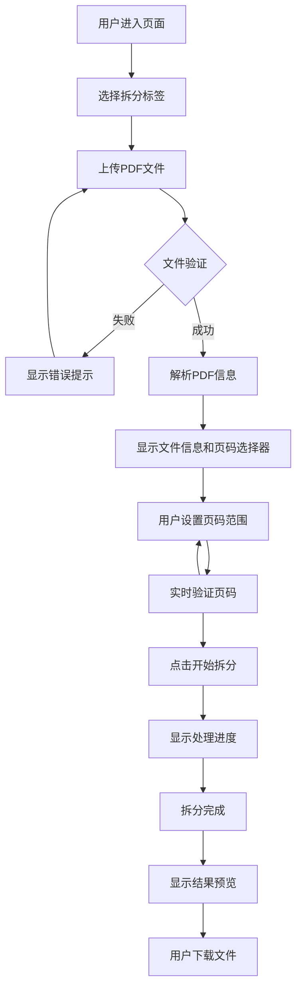
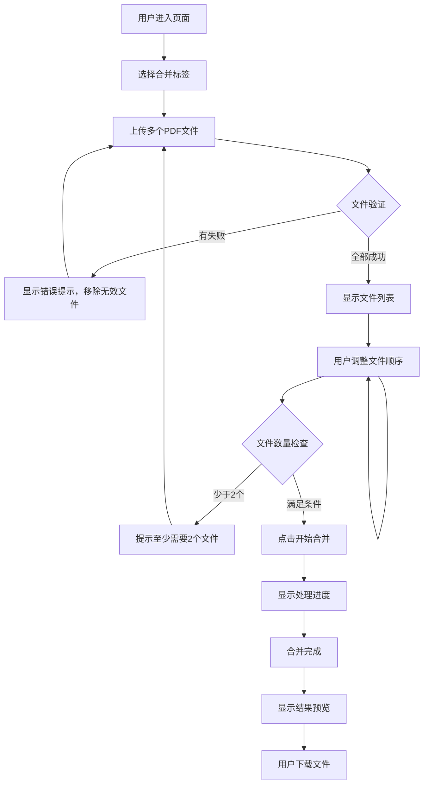

# PDF工具箱 - 产品需求文档 (PRD)

**版本**: v1.0  
**创建时间**: 2025-11-18  
**产品经理**: AI Assistant  

---

## 1. 产品概述

### 1.1 产品定位
PDF工具箱是一款专业的在线PDF处理工具，专注于PDF文件的拆分与合并功能，为用户提供简单、高效、安全的PDF处理体验。

### 1.2 目标用户
- **办公人员**: 需要处理合同、报告等PDF文档的特定页面
- **学生群体**: 整理课件、论文资料，合并多个PDF文档
- **设计师**: 处理多页设计稿，提取特定页面内容
- **法务人员**: 提取合同条款、文档特定章节
- **个人用户**: 日常PDF文档处理需求

### 1.3 核心价值
- **操作简单**: 直观的拖拽上传，一键处理
- **功能专业**: 精确的页码控制，灵活的文件管理
- **隐私安全**: 客户端处理，文件不上传服务器
- **响应迅速**: 本地处理，无需等待网络传输

---

## 2. 功能需求清单

### 2.1 核心功能模块

#### 2.1.1 PDF拆分功能
**功能描述**: 根据用户指定的页码范围，从源PDF文件中提取特定页面生成新文件

**详细需求**:
- ✅ 支持单个PDF文件上传 (最大50MB)
- ✅ 自动识别PDF总页数
- ✅ 可视化页码范围选择器
- ✅ 实时页码验证 (起始页 ≤ 结束页 ≤ 总页数)
- ✅ 页数计算预览
- ✅ 拆分结果预览
- ✅ 生成新PDF文件下载

**输入参数**:
- 源PDF文件
- 起始页码 (1-N)
- 结束页码 (起始页-N)

**输出结果**:
- 新的PDF文件 (包含指定页码范围)
- 文件名格式: `原文件名_第X-Y页.pdf`

#### 2.1.2 PDF合并功能
**功能描述**: 将多个PDF文件按指定顺序合并成单个PDF文件

**详细需求**:
- ✅ 支持多个PDF文件上传 (每个最大50MB)
- ✅ 文件列表可视化展示
- ✅ 拖拽调整文件顺序
- ✅ 显示每个文件的页数信息
- ✅ 支持移除单个文件
- ✅ 合并进度显示
- ✅ 合并结果预览
- ✅ 生成合并PDF文件下载

**输入参数**:
- 多个PDF文件数组
- 文件合并顺序

**输出结果**:
- 合并后的PDF文件
- 文件名格式: `合并文档_YYYYMMDD_HHMMSS.pdf`

### 2.2 辅助功能模块

#### 2.2.1 文件管理
- 文件上传进度显示
- 文件大小和页数信息展示
- 文件移除功能
- 批量清空功能

#### 2.2.2 用户交互
- 拖拽上传支持
- 实时状态反馈
- 错误提示和处理
- 操作确认机制

#### 2.2.3 界面体验
- 响应式设计 (支持桌面端、平板、手机)
- 标签页切换
- 加载动画
- 操作成功/失败提示

---

## 3. 技术架构设计

### 3.1 整体架构

```
┌─────────────────────────────────────────┐
│              前端层 (Frontend)           │
├─────────────────────────────────────────┤
│  • HTML5 + CSS3 + JavaScript (ES6+)    │
│  • PDF.js (PDF解析和渲染)               │
│  • jsPDF (PDF生成)                      │
│  • 响应式UI组件                         │
└─────────────────────────────────────────┘
                    ↓
┌─────────────────────────────────────────┐
│            浏览器API层                   │
├─────────────────────────────────────────┤
│  • File API (文件读取)                  │
│  • Canvas API (PDF渲染)                 │
│  • Blob API (文件生成)                  │
│  • Download API (文件下载)              │
└─────────────────────────────────────────┘
```

### 3.2 技术选型

#### 3.2.1 前端技术栈
```javascript
// 核心技术
- HTML5: 语义化结构，文件API支持
- CSS3: 现代样式，动画效果
- JavaScript ES6+: 模块化开发，异步处理

// PDF处理库
- PDF.js: Mozilla开源PDF解析库
- jsPDF: 客户端PDF生成库
- pdf-lib: 高级PDF操作库 (备选)

// 工具库
- FileSaver.js: 文件下载处理
- SortableJS: 拖拽排序功能 (可选)
```

#### 3.2.2 部署架构
```
┌─────────────────┐    ┌─────────────────┐
│   CDN/静态托管   │    │   用户浏览器     │
│  (GitHub Pages, │ ←→ │   (客户端处理)   │
│   Vercel, 等)   │    │                 │
└─────────────────┘    └─────────────────┘

特点:
• 纯静态部署，无需服务器
• 所有处理在客户端完成
• 文件不离开用户设备
• 部署成本低，维护简单
```

### 3.3 核心模块设计

#### 3.3.1 文件处理模块 (FileProcessor)
```javascript
class FileProcessor {
  // PDF文件解析
  async parsePDF(file) {
    // 使用PDF.js解析PDF
    // 返回页数、元数据等信息
  }
  
  // PDF拆分
  async splitPDF(file, startPage, endPage) {
    // 提取指定页面范围
    // 生成新的PDF文件
  }
  
  // PDF合并  
  async mergePDFs(files) {
    // 按顺序合并多个PDF
    // 生成合并后的PDF文件
  }
}
```

#### 3.3.2 UI控制模块 (UIController)
```javascript
class UIController {
  // 标签页切换
  switchTab(tabName) { }
  
  // 文件上传处理
  handleFileUpload(files, type) { }
  
  // 拖拽排序
  initDragAndDrop() { }
  
  // 状态消息显示
  showMessage(message, type) { }
}
```

#### 3.3.3 状态管理模块 (StateManager)
```javascript
class StateManager {
  constructor() {
    this.splitFile = null;
    this.mergeFiles = [];
    this.processingStatus = 'idle';
  }
  
  // 状态更新方法
  updateSplitFile(file) { }
  updateMergeFiles(files) { }
  setProcessingStatus(status) { }
}
```

---

## 4. API接口规范

### 4.1 接口说明
**注意**: 当前版本为纯前端实现，无需后端API。以下接口规范为未来扩展预留。

### 4.2 文件上传接口 (预留)

#### 4.2.1 上传文件
```http
POST /api/upload
Content-Type: multipart/form-data

Request Body:
- file: PDF文件 (binary)
- type: 操作类型 ("split" | "merge")

Response:
{
  "code": 200,
  "message": "上传成功",
  "data": {
    "fileId": "uuid",
    "fileName": "document.pdf",
    "fileSize": 2048576,
    "pageCount": 20,
    "uploadTime": "2025-11-18T10:30:00Z"
  }
}
```

#### 4.2.2 PDF拆分接口
```http
POST /api/split
Content-Type: application/json

Request Body:
{
  "fileId": "uuid",
  "startPage": 1,
  "endPage": 5
}

Response:
{
  "code": 200,
  "message": "拆分成功",
  "data": {
    "resultFileId": "uuid",
    "downloadUrl": "/api/download/uuid",
    "pageCount": 5,
    "processTime": 1.2
  }
}
```

#### 4.2.3 PDF合并接口
```http
POST /api/merge
Content-Type: application/json

Request Body:
{
  "fileIds": ["uuid1", "uuid2", "uuid3"],
  "fileName": "merged_document.pdf"
}

Response:
{
  "code": 200,
  "message": "合并成功",
  "data": {
    "resultFileId": "uuid",
    "downloadUrl": "/api/download/uuid",
    "totalPages": 45,
    "processTime": 3.5
  }
}
```

---

## 5. 数据库设计

### 5.1 数据库说明
**注意**: 当前版本为纯前端实现，无需数据库。以下设计为未来扩展预留。

### 5.2 表结构设计

#### 5.2.1 文件表 (files)
```sql
CREATE TABLE files (
  id VARCHAR(36) PRIMARY KEY COMMENT '文件ID',
  original_name VARCHAR(255) NOT NULL COMMENT '原始文件名',
  stored_name VARCHAR(255) NOT NULL COMMENT '存储文件名',
  file_size BIGINT NOT NULL COMMENT '文件大小(字节)',
  page_count INT NOT NULL COMMENT '页数',
  file_type VARCHAR(20) DEFAULT 'pdf' COMMENT '文件类型',
  upload_time TIMESTAMP DEFAULT CURRENT_TIMESTAMP COMMENT '上传时间',
  expire_time TIMESTAMP COMMENT '过期时间',
  status TINYINT DEFAULT 1 COMMENT '状态: 1-正常 0-删除',
  INDEX idx_upload_time (upload_time),
  INDEX idx_expire_time (expire_time)
) ENGINE=InnoDB DEFAULT CHARSET=utf8mb4 COMMENT='文件信息表';
```

#### 5.2.2 操作记录表 (operations)
```sql
CREATE TABLE operations (
  id BIGINT AUTO_INCREMENT PRIMARY KEY,
  operation_type VARCHAR(20) NOT NULL COMMENT '操作类型: split/merge',
  source_files JSON NOT NULL COMMENT '源文件ID列表',
  result_file_id VARCHAR(36) COMMENT '结果文件ID',
  parameters JSON COMMENT '操作参数',
  process_time DECIMAL(10,3) COMMENT '处理耗时(秒)',
  create_time TIMESTAMP DEFAULT CURRENT_TIMESTAMP,
  status TINYINT DEFAULT 1 COMMENT '状态: 1-成功 0-失败',
  INDEX idx_create_time (create_time),
  INDEX idx_operation_type (operation_type)
) ENGINE=InnoDB DEFAULT CHARSET=utf8mb4 COMMENT='操作记录表';
```

---

## 6. 用户交互流程

### 6.1 PDF拆分流程



### 6.2 PDF合并流程



### 6.3 详细交互说明

#### 6.3.1 文件上传交互
1. **拖拽上传**
   - 用户将文件拖拽到上传区域
   - 区域高亮显示，提示可以释放
   - 释放文件后开始上传处理

2. **点击上传**
   - 用户点击上传区域
   - 打开文件选择对话框
   - 选择文件后开始处理

3. **文件验证**
   - 检查文件格式 (仅支持PDF)
   - 检查文件大小 (≤50MB)
   - 检查文件完整性

#### 6.3.2 页码选择交互 (拆分功能)
1. **页码输入**
   - 起始页码默认为1
   - 结束页码默认为总页数
   - 支持手动输入和修改

2. **实时验证**
   - 起始页 ≤ 结束页
   - 页码范围在1到总页数之间
   - 实时显示将提取的页数

3. **错误处理**
   - 无效输入自动纠正
   - 显示友好的错误提示

#### 6.3.3 文件排序交互 (合并功能)
1. **列表展示**
   - 显示文件名、大小、页数
   - 按上传顺序排列
   - 每个文件有移除按钮

2. **拖拽排序**
   - 鼠标悬停显示拖拽手柄
   - 拖拽过程中高亮显示
   - 释放后更新顺序

3. **文件管理**
   - 单个文件移除
   - 批量清空所有文件
   - 重新上传文件

#### 6.3.4 处理进度反馈
1. **加载状态**
   - 按钮显示加载动画
   - 禁用相关操作按钮
   - 显示处理提示文字

2. **进度展示**
   - 简单的加载指示器
   - 预估处理时间提示
   - 可取消操作 (可选)

3. **结果反馈**
   - 成功: 绿色提示 + 结果预览
   - 失败: 红色错误提示 + 重试选项
   - 自动消失的状态消息

#### 6.3.5 下载交互
1. **结果预览**
   - 显示处理结果摘要
   - 新文件的页数信息
   - 预览缩略图 (可选)

2. **下载操作**
   - 明显的下载按钮
   - 自动命名文件
   - 支持重新处理

---

## 7. 非功能性需求

### 7.1 性能要求
- **文件处理速度**: 10MB PDF文件处理时间 < 5秒
- **页面加载时间**: 首次加载 < 2秒
- **内存使用**: 处理50MB文件时内存占用 < 200MB
- **并发处理**: 支持同时处理多个文件操作

### 7.2 兼容性要求
- **浏览器支持**: Chrome 80+, Firefox 75+, Safari 13+, Edge 80+
- **移动端支持**: iOS Safari 13+, Android Chrome 80+
- **屏幕分辨率**: 320px - 2560px 宽度自适应

### 7.3 安全性要求
- **隐私保护**: 所有文件处理在本地完成，不上传服务器
- **数据安全**: 处理完成后自动清理临时数据
- **输入验证**: 严格验证上传文件格式和大小

### 7.4 可用性要求
- **操作简单**: 核心功能3步内完成
- **错误恢复**: 友好的错误提示和恢复机制
- **无障碍**: 支持键盘导航和屏幕阅读器

---

## 8. 项目规划

### 8.1 开发阶段

#### Phase 1: 基础功能 (2周)
- ✅ UI界面设计和实现
- ✅ 文件上传功能
- ✅ 基础交互逻辑

#### Phase 2: 核心功能 (3周)
- PDF.js集成和PDF解析
- PDF拆分功能实现
- PDF合并功能实现
- 文件下载功能

#### Phase 3: 优化完善 (2周)
- 性能优化
- 错误处理完善
- 移动端适配
- 用户体验优化

#### Phase 4: 测试发布 (1周)
- 功能测试
- 兼容性测试
- 性能测试
- 部署上线

### 8.2 技术风险评估

#### 8.2.1 高风险项
- **PDF处理性能**: 大文件处理可能导致浏览器卡顿
  - *缓解方案*: 分块处理，Web Worker异步处理
- **内存占用**: 多个大文件同时处理内存溢出
  - *缓解方案*: 文件大小限制，处理队列机制

#### 8.2.2 中等风险项
- **浏览器兼容性**: 不同浏览器PDF处理差异
  - *缓解方案*: 充分测试，降级处理方案
- **文件格式支持**: 特殊PDF格式解析失败
  - *缓解方案*: 错误处理，格式检测

### 8.3 成功指标

#### 8.3.1 功能指标
- PDF拆分成功率 > 95%
- PDF合并成功率 > 95%
- 文件处理准确率 100%

#### 8.3.2 性能指标
- 10MB文件处理时间 < 5秒
- 页面首次加载时间 < 2秒
- 移动端操作响应时间 < 1秒

#### 8.3.3 用户体验指标
- 操作成功率 > 90%
- 用户完成任务时间 < 2分钟
- 错误提示理解率 > 95%

---

## 9. 总结

PDF工具箱是一款专注于PDF拆分和合并的轻量级工具，采用纯前端技术实现，具有以下优势：

### 9.1 产品优势
- **隐私安全**: 文件不离开设备，完全本地处理
- **操作简单**: 直观的拖拽交互，一键完成处理
- **响应迅速**: 无需网络传输，处理速度快
- **成本低廉**: 纯静态部署，无服务器成本

### 9.2 技术特色
- **现代化技术栈**: HTML5 + CSS3 + ES6+
- **专业PDF处理**: PDF.js + jsPDF 组合
- **响应式设计**: 完美适配各种设备
- **渐进增强**: 基础功能稳定，可扩展性强

### 9.3 发展规划
- **短期**: 完善核心功能，优化用户体验
- **中期**: 支持更多PDF操作 (加密、水印等)
- **长期**: 发展为综合性PDF工具平台

这份PRD为PDF工具箱的开发提供了完整的指导，涵盖了从功能设计到技术实现的各个方面，确保产品能够满足用户需求并具备良好的可维护性和扩展性。